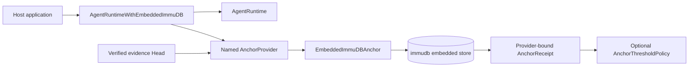
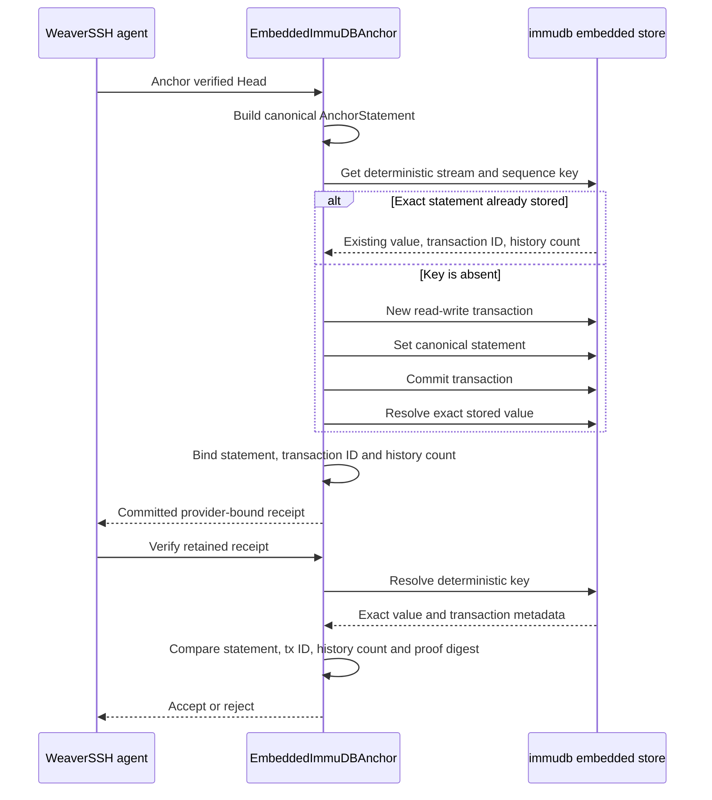

# Embedded immudb evidence storage for WeaverSSH agents

WeaverSSH agents can run an immudb key-value store inside the agent process. This mode is intended for deployments where installing or reaching a separate immudb server is impractical, but the agent still needs persistent tamper-evident evidence receipts.

The implementation follows immudb's embedded key-value API: open a local store, create a read-write transaction, commit the canonical anchor statement, and resolve the retained value and transaction metadata before returning a receipt.

## Runtime structure



`AgentRuntimeWithEmbeddedImmuDB` owns both the normal agent runtime and the embedded store. Its `Close` method closes both exactly once. The store directory remains on disk and can be reopened by a later agent process, allowing old receipts to be verified after an agent restart.

## Embedding in an application

```go
embeddedAgent, err := app.NewAgentRuntimeWithEmbeddedImmuDB(
    agentConfig,
    x11Cookie,
    app.AgentEmbeddedImmuDBConfig{
        Path:         "/var/lib/weaverssh/agent-evidence",
        ProviderName: "node-a-local",
    },
)
if err != nil {
    return err
}
defer embeddedAgent.Close()

receipt, err := embeddedAgent.AnchorEvidenceHead(ctx, verifiedHead)
if err != nil {
    return err
}

if err := embeddedAgent.VerifyEvidenceReceipt(ctx, verifiedHead, receipt); err != nil {
    return err
}
```

For embedding without a network listener, set `AgentConfig.InterfaceMode` to `library`. The host application can then use `AgentRuntime.ServeConn` for its in-process transport while the embedded store persists evidence locally.

## Environment-derived configuration

Applications that construct the wrapper from environment variables can use:

| Variable | Purpose |
|---|---|
| `WEAVERSSH_AGENT_IMMUDB_PATH` | Persistent embedded immudb directory |
| `WEAVERSSH_AGENT_IMMUDB_PROVIDER` | Provider identity written into receipts |

`AgentEmbeddedImmuDBConfigFromEnv` reads these values. The path is required. The provider identity defaults to `agent-embedded-immudb` when omitted.

## Provider configuration

The same embedded implementation is available to `wv-evidence-anchor` through `weaverssh.evidence-provider-config.v1`:

```json
{
  "version": "weaverssh.evidence-provider-config.v1",
  "threshold": 1,
  "providers": [
    {
      "name": "node-a-local",
      "type": "embedded-immudb",
      "path": "/var/lib/weaverssh/agent-evidence"
    }
  ]
}
```

An embedded provider accepts `path`, not `base_url`, `token`, or `token_env`. Provider configuration is strictly decoded, and all opened local stores are closed after CLI operations.

## Commitment and verification



The deterministic key binds one stream and sequence position. Repeating the same statement is idempotent. Attempting to bind a different statement at the same position is rejected.

The receipt binds:

- the exact canonical anchor statement;
- the embedded-store transaction ID;
- the key history count;
- the configured provider identity;
- a domain-separated SHA-256 digest over those values.

## Filesystem and lifecycle controls

The implementation:

- converts the store path to an absolute path;
- rejects a symbolic-link store root;
- creates the directory with owner-only permissions;
- opens one immudb store per configured provider instance;
- serializes store access against shutdown;
- rejects anchoring and verification after close;
- preserves the database directory across agent restarts.

The parent directories, volume, backup policy, and host access controls remain the operator's responsibility.

## Trust boundary

An embedded store is local tamper-evident persistence. It is **not an independent witness** when it shares the agent's machine, filesystem, administrator, encryption keys, or backup authority. A privileged attacker who can delete the entire agent state may delete both the producer log and the embedded database.

For stronger denial resistance, combine the embedded provider with independently administered immudb, Fabric, or other external providers and require an N-of-M threshold. A local embedded receipt may count as one provider, but it should not be treated as equivalent to an independently retained remote head.

## Dependency and licensing

The implementation imports `github.com/codenotary/immudb/embedded/store` and pins the dependency in the repository module lock. The immudb documentation site states that its documentation is released under Apache 2.0, while the current immudb source repository license declares Business Source License 1.1 terms for the licensed work. Deployments, embedding, and redistribution must therefore be reviewed against the license shipped with the exact immudb source version selected by WeaverSSH. This does not change WeaverSSH's Apache 2.0 license for original WeaverSSH code.
