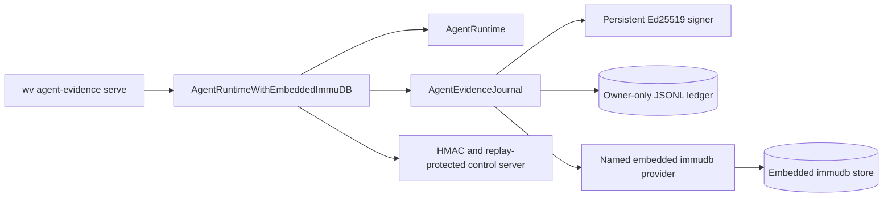
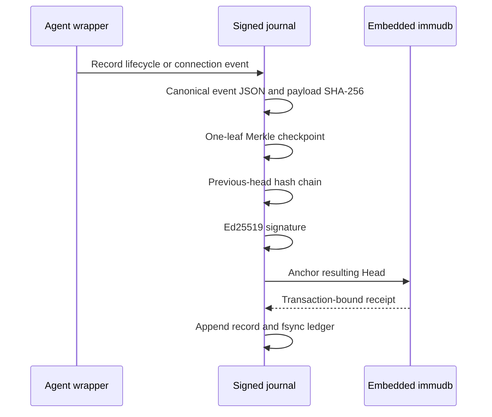
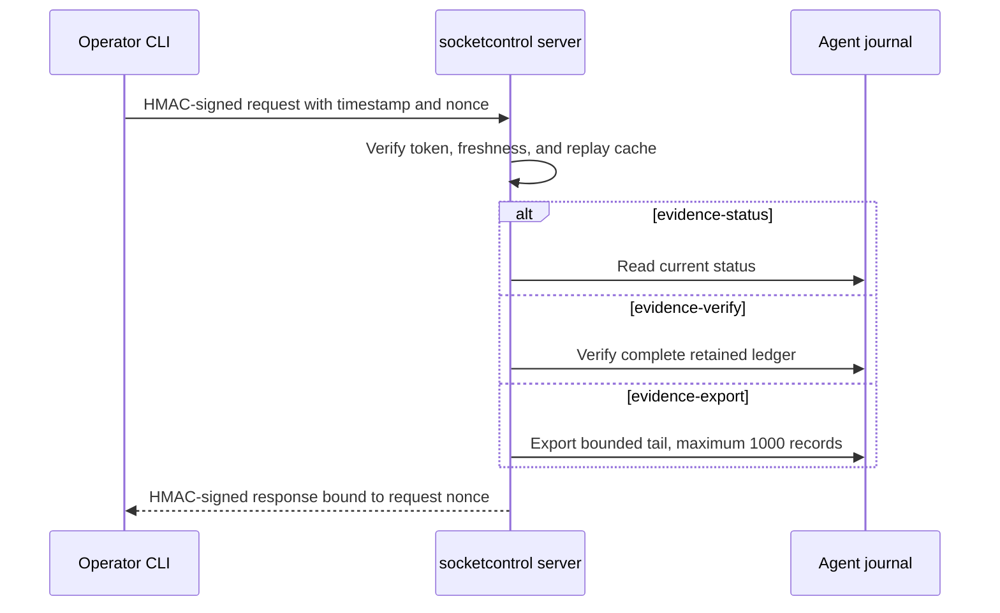

# Automated agent evidence journaling and control

`wv agent-evidence serve` runs a normal WeaverSSH agent with a persistent signed event journal, embedded immudb head anchoring, and authenticated local status, verification, and export operations.

## Runtime flow



The evidence root contains separate `store` and `journal` directories. The journal key and ledger are mode `0600`; the directories are mode `0700` where the operating system supports Unix permission bits.

## Event commitment



Each record retains the event, leaf, Merkle proof, signed statement, resulting head, and embedded-provider receipt. Reopening the journal verifies every payload digest, proof, signature, chain edge, head, and receipt before the agent starts serving connections.

Automatically recorded event kinds include:

- `runtime.initialized` and `runtime.stopping`;
- `listener.started`, `listener.closed`, and `listener.failed`;
- `connection.accepted` and `connection.closed`;
- `connection.accept_failed`.

Event details are metadata only. They must not contain X11 cookies, private keys, bearer tokens, proof frames, credentials, or unredacted application payloads.

## Authenticated operator access



Commands:

```text
wv agent-evidence serve --embedded-immudb-path /var/lib/weaverssh/evidence
wv agent-evidence status
wv agent-evidence verify
wv agent-evidence export --limit 100
```

The control transport is a mode-`0600` Unix socket by default. Windows uses loopback TCP. TCP control listeners are rejected unless the address is loopback. The HMAC token file is mode `0600`, and symbolic-link token files are rejected.

## Trust boundary

The embedded database and local journal provide tamper-evident persistence and make accidental or unprivileged rewriting detectable. They are not independent witnesses when the same administrator controls the agent, filesystem, backups, and encryption keys. For stronger denial resistance, anchor resulting heads to independently administered remote immudb or Fabric providers through the N-of-M policy from PR #2.
