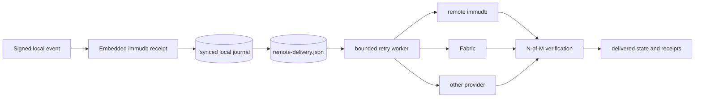
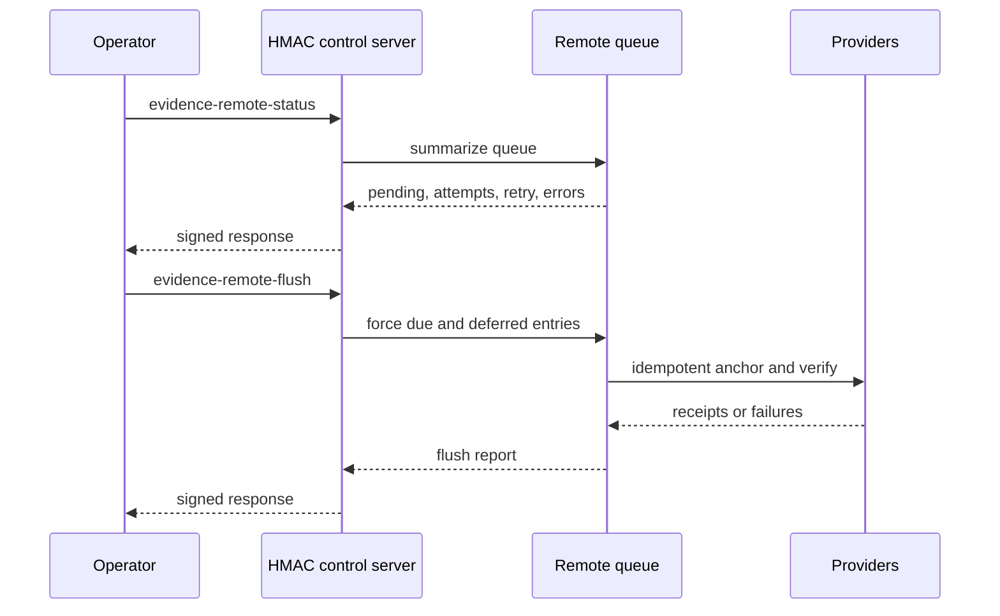
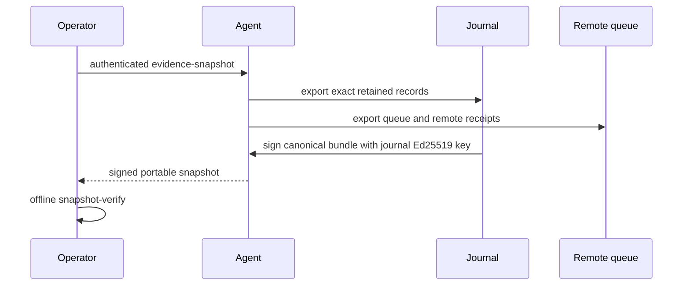

# Remote evidence delivery and signed snapshots

`wv agent-evidence serve` can deliver every locally committed evidence head to an independently administered N-of-M provider policy. Delivery is asynchronous and durable: local event recording does not depend on immediate remote availability, and queue state survives agent restarts.

## Durable delivery flow



The queue stores the exact `Head`, receipts already obtained, attempt counters, the next attempt time, the last error, and the delivered time. Partial receipts are retained. Repeated attempts are safe because provider operations use deterministic idempotency keys.

On startup, the agent re-enqueues all retained journal heads. A delivered item remains in the queue as an auditable receipt record. An unavailable remote provider does not prevent the local agent from reopening its journal.

## Configuration

```text
wv agent-evidence serve \
  --embedded-immudb-path /var/lib/weaverssh/evidence \
  --remote-providers /etc/weaverssh/remote-providers.json \
  --remote-queue /var/lib/weaverssh/evidence/remote-delivery.json \
  --remote-retry-min 5s \
  --remote-retry-max 5m \
  --remote-poll 1s \
  --remote-timeout 30s
```

Environment alternatives:

| Variable | Purpose |
|---|---|
| `WEAVERSSH_AGENT_REMOTE_PROVIDERS` | N-of-M provider configuration file |
| `WEAVERSSH_AGENT_REMOTE_QUEUE` | Durable queue-state path |

The remote provider configuration uses `weaverssh.evidence-provider-config.v1`. `embedded-immudb` entries are rejected for this role because same-host storage is not an independent witness.

## Authenticated operations



Commands:

```text
wv agent-evidence remote-status
wv agent-evidence remote-flush
```

Status reports whether remote delivery is enabled, pending and delivered item counts, total attempts, next retry time, last failure, and the last delivered head. Shutdown performs one bounded forced flush before closing providers.

## Signed snapshots



Create and verify:

```text
wv agent-evidence snapshot --out evidence-snapshot.json
wv agent-evidence snapshot-verify --file evidence-snapshot.json
```

The snapshot file is written with owner-only permissions. Offline verification checks the outer Ed25519 signature, event payload hashes, Merkle proofs, checkpoint signatures, hash-chain continuity, heads, and receipt-to-head bindings. It does not contact provider backends; live remote verification remains a separate operation.

## Security boundary

The queue and snapshot contain event metadata, evidence heads, signatures, and provider receipts. They must not contain X11 cookies, private keys, bearer tokens, authproof frames, credentials, or application payloads. A signed snapshot proves what the journal signer exported, but independent provider state is still required to resist a privileged host administrator who can delete all local files.
