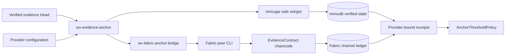

# Evidence provider operations

This document covers the operational layer stacked on the cryptographic evidence core. The core verifies hashes, Merkle proofs, signatures, statement chains, receipts, and provider quorum. This layer supplies configuration, commands, a Fabric bridge, chaincode, and live test harnesses.

## Runtime components



## Provider configuration

`wv-evidence-anchor` reads `weaverssh.evidence-provider-config.v1` JSON. Each provider has an independent name, even when multiple instances use the same backend type. This prevents a receipt from one immudb or Fabric deployment from being replayed as another provider's receipt.

Secrets should normally use `token_env`; inline tokens exist for constrained test fixtures only. An omitted threshold requires every configured provider. A numeric threshold enables N-of-M operation.

```bash
export WEAVERSSH_IMMUGW_TOKEN=...
export WEAVERSSH_FABRIC_BRIDGE_TOKEN=...

go run ./cmd/wv-evidence-anchor anchor \
  --config docs/examples/evidence-binding/providers.local.json \
  --head docs/examples/evidence-binding/head.json \
  --out receipts.json

go run ./cmd/wv-evidence-anchor verify \
  --config docs/examples/evidence-binding/providers.local.json \
  --head docs/examples/evidence-binding/head.json \
  --receipts receipts.json
```

## Fabric bridge boundary

The bridge intentionally isolates WeaverSSH from Fabric deployment credentials and peer configuration. It accepts only the narrow submit/evaluate contract expected by `FabricAnchor`.

On submit it:

1. authenticates the HTTP request;
2. strictly decodes and validates the exact anchor statement;
3. invokes chaincode with `peer chaincode invoke --waitForEvent`;
4. queries the committed record back from chaincode;
5. requires the idempotency key, statement, and transaction ID to match;
6. reads channel height and returns committed block metadata.

On evaluate it queries and returns the retained record without modifying ledger state. The bridge must run with a Fabric identity whose permissions and endorsement scope are intentionally constrained.

## Chaincode behavior

`EvidenceContract.AnchorEvidence` stores one record under a deterministic hash of the idempotency key. Repeating the same key and statement is idempotent. Reusing the key with a different statement is rejected. `ReadEvidenceAnchor` returns the retained statement and original Fabric transaction ID.

## Live tests

The normal repository suite uses deterministic unit providers. Live provider tests are opt-in because they download containers or Fabric binaries and start local infrastructure.

```bash
make evidence-binding-immudb-live-test
make evidence-binding-fabric-live-test
make evidence-binding-live-test
```

The immudb test uses pinned `immudb` and `immugw` images, authenticates to immugw, performs verified safe set/get, and verifies the returned receipt.

The Fabric test installs pinned Fabric samples, binaries, and images, starts the official test network, deploys the WeaverSSH chaincode, starts the bridge, and performs submit plus evaluate verification.

Set `WEAVERSSH_KEEP_EVIDENCE_STACK=1` to retain the local services for inspection after a test.

## Security limits

These harnesses demonstrate real provider round trips; they are not production deployment manifests. Production deployments still require TLS, credential rotation, restricted Fabric MSP identities, independent immudb auditor state, persistent volumes, backup policy, bridge authentication, network policy, monitoring, and separate administrative control of quorum providers.
