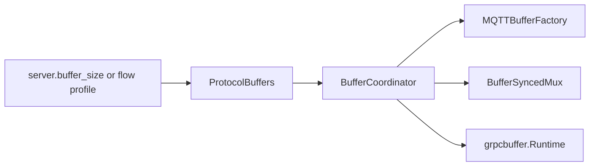

# MQTT, SSH channel, and gRPC buffer synchronization

WeaverSSH uses one generation-numbered buffering contract for MQTT, logical SSH channels, and gRPC. A settings reload must not update one transport while another retains an incompatible frame, window, or message limit.

## One authority



`ProtocolBuffersFromFrame` and `ProtocolBuffersFromProfile` derive:

- one common frame size;
- one queue depth;
- one common in-flight window equal to `frame × queue`;
- MQTT read/write buffers and maximum packet size;
- SSH channel DATA frame and credit window;
- gRPC read/write buffers, stream window, connection window, and message limit.

Validation rejects any structure where a transport-specific value differs from the common frame or window.

## Atomic changes

```mermaid
sequenceDiagram
    participant C as Config reload or remote update
    participant B as BufferCoordinator
    participant M as MQTT
    participant S as SSH mux
    participant G as gRPC

    C->>B: BufferUpdate(previous digest, generation, profile)
    B->>M: Prepare(snapshot)
    B->>S: Prepare(snapshot)
    B->>G: Prepare(snapshot)
    alt every participant accepts
        B->>B: Commit generation atomically
        B->>M: Commit(snapshot)
        B->>S: Commit(snapshot)
        B->>G: Commit(snapshot)
    else any participant rejects
        B-->>C: reject; no participant commits
    end
```

Each update is bound to the previous snapshot digest. Replayed, skipped, reordered, or edited updates fail before transport state changes.

## Runtime behavior

### MQTT

`MQTTBufferFactory` creates clients with the exact read/write sizes from the current generation. When a generation changes, old clients are closed and must reconnect. This prevents a long-lived MQTT connection from continuing with stale buffers.

### SSH logical channels

`BufferSyncedMux` derives `InitialWindow`, `WindowUpdateThreshold`, and `MaxDataPayload` from the shared contract. Active streams can grow safely. A shrink is rejected while streams are active because previously advertised channel credit and frame limits cannot be revoked safely. After streams drain, the same shrink can be retried.

### gRPC

`grpcbuffer.Runtime` exposes generation-bound options for gRPC client and server construction. A committed update marks old generations stale and invokes an optional recycle callback so clients and servers can drain and reopen using the new windows and message limits.

## Settings propagation

The exact `BufferUpdate` bytes may be transported through any supported control path:

- MQTT: `weaverssh/settings/protocol-buffers/v1` through `PublishProtocolBufferUpdate` and `ApplyProtocolBufferMessage`;
- SSH: a `ServiceControl` stream with metadata `weaverssh.protocol-buffers.v1`;
- gRPC: `grpcbuffer.UpdateService.Apply`, whose request payload is the same strict update envelope.

All three paths call `BufferCoordinator.Apply`. They do not copy individual settings independently.

## Configuration reload

`BindProtocolBufferCoordinator` treats `server.buffer_size` as the authoritative frame size and derives every transport setting after `ConfigManager.Reload`. It deliberately reads the newly installed config instead of trusting the legacy watcher callback argument.

## Safety boundaries

- A failed participant preparation causes a full rollback before commit.
- Stale generations and digest mismatches are rejected.
- Existing MQTT clients are recycled after a change.
- Active SSH channels reject unsafe decreases.
- Existing gRPC connections are marked stale and should be gracefully recycled.
- Distribution authenticates alignment, not authorization. MQTT, SSH, or gRPC control endpoints must still enforce their normal authentication and policy checks.
