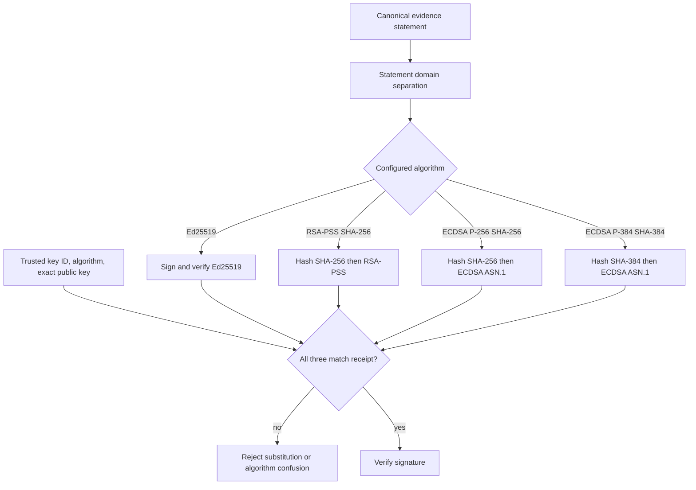
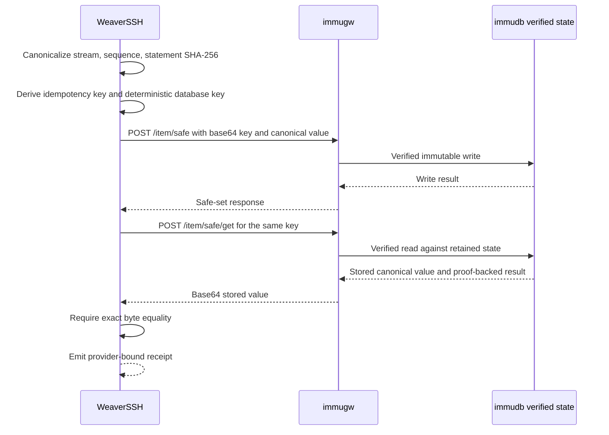
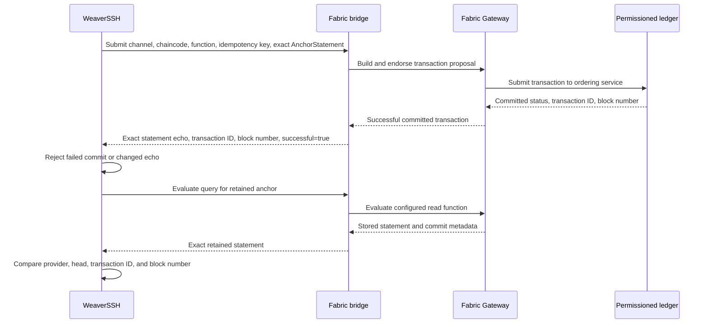
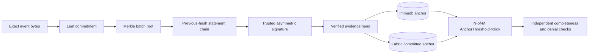

# Cryptographic binding providers

The evidence core composes five distinct mechanisms. They solve different denial and tampering problems and must not be treated as interchangeable.

| Option | WeaverSSH implementation | What it detects | Boundary |
|---|---|---|---|
| Hash chaining | `PreviousSHA256`, sequence validation, and witnessed heads | Entry rewriting, removal, insertion, reordering, and replay inside the chain | A rewritten final entry requires an independently retained old head to detect it |
| Merkle trees | Domain-separated leaf/node hashes and inclusion proofs | Payload, metadata, sibling, direction, order, index, count, or root tampering | Inclusion proves membership in a batch, not that the batch is the latest one |
| Digital signatures | Ed25519, RSA-PSS/SHA-256, ECDSA P-256/SHA-256, and ECDSA P-384/SHA-384 | Statement mutation, key substitution, algorithm confusion, weak RSA keys, and wrong-curve ECDSA keys | Attribution is to possession of a configured trusted private key |
| Immutable database | `ImmuDBAnchor` using immugw verified safe set/get operations | Deletion or substitution of an anchored head when the verified database state is retained | WeaverSSH verifies the exact round trip; immudb supplies the immutable state and proof system |
| Permissioned ledger | `FabricAnchor` bridge requiring successful commit metadata and exact statement echo | Rejected commits, changed transaction payloads, provider/head replay, transaction or block substitution | The bridge must use Fabric Gateway and wait for successful commit status |

## Multi-algorithm digital signatures

`SignatureTrustPolicy` binds each key identifier to one exact algorithm and exact public-key encoding. The public key embedded in a receipt cannot authorize itself.

RSA keys shorter than 2048 bits are rejected. P-256 and P-384 keys are rejected when used under the other curve's algorithm identifier.

## Immutable database anchoring with immudb

`ImmuDBAnchor` stores the canonical `AnchorStatement`, not a free-form status string. The key is deterministic for the stream and sequence, and the value is read back through immugw's verified safe-get endpoint before a receipt is returned.

A successful HTTP write alone is insufficient. The adapter rejects the anchor unless the verified read returns exactly the canonical statement bytes.

## Permissioned-ledger anchoring with Hyperledger Fabric

`FabricAnchor` deliberately uses a narrow HTTP bridge contract so WeaverSSH does not import or embed a Fabric SDK. The bridge is responsible for using Fabric Gateway, submitting the configured chaincode transaction, and waiting for successful commit status.

An endorsement result or submitted transaction without successful commit status is not accepted as an anchor.

## Composed verification path

`AnchorThresholdPolicy` counts at most one valid receipt from each configured provider. Duplicate receipts, unknown providers, invalid receipts, and failed verification never increase quorum. This permits policies such as two valid anchors out of three independently operated providers.

Using multiple external providers gives independent failure domains, but it does not remove the need to protect signing keys, trust-policy configuration, immudb client state, Fabric identities, bridge credentials, or transport security.
