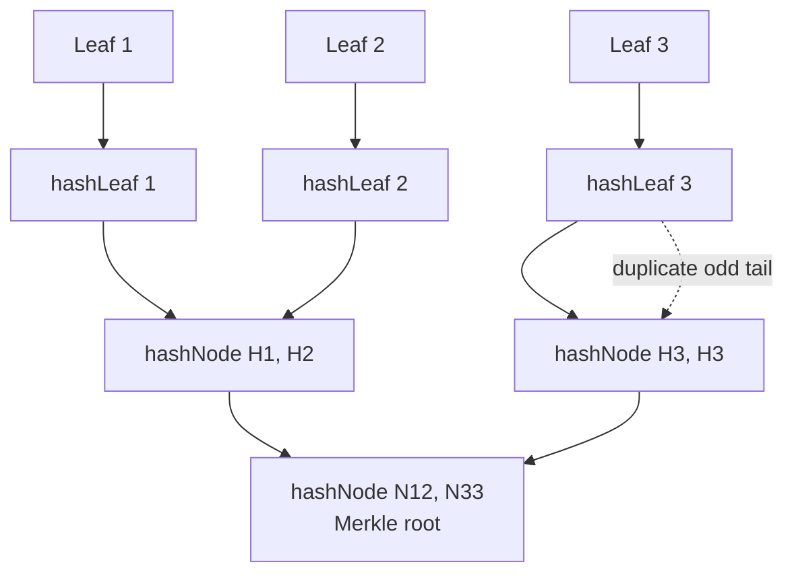
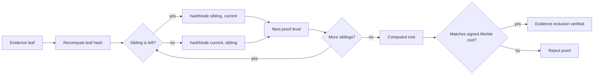
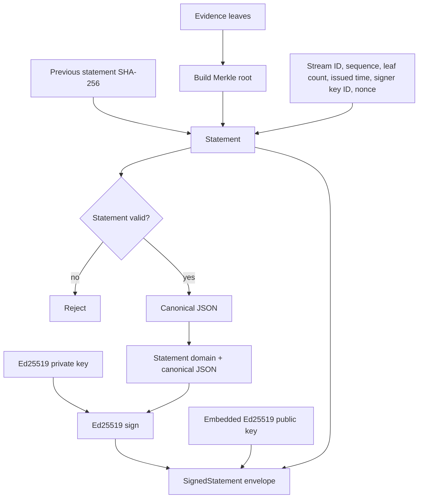
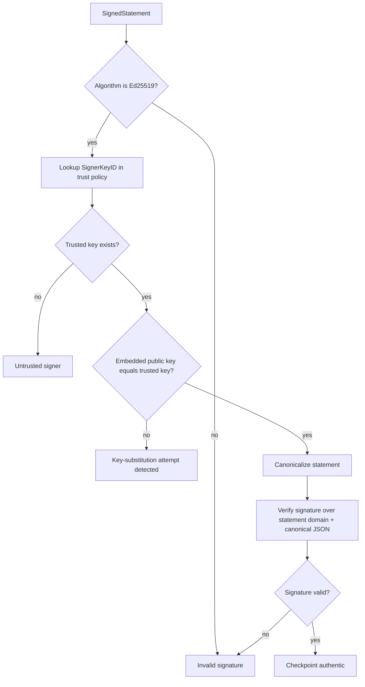
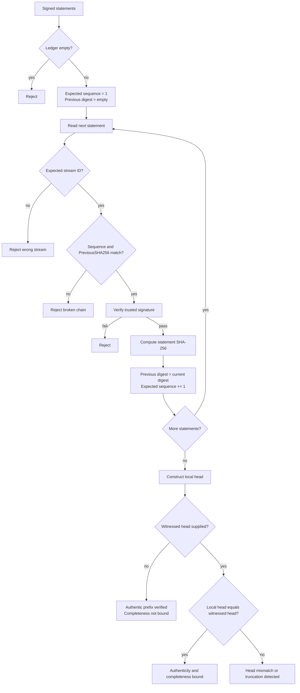
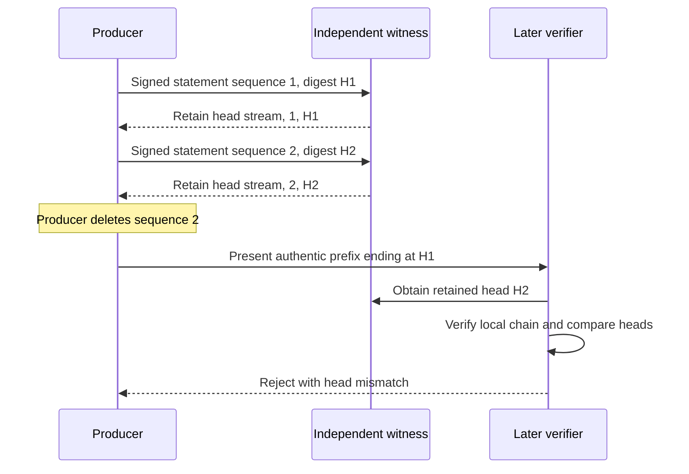
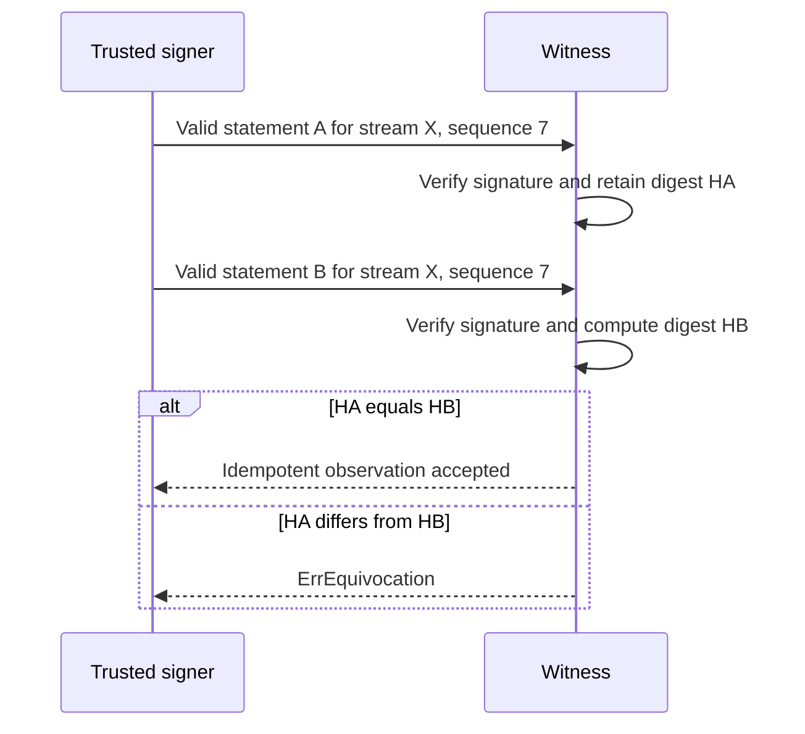
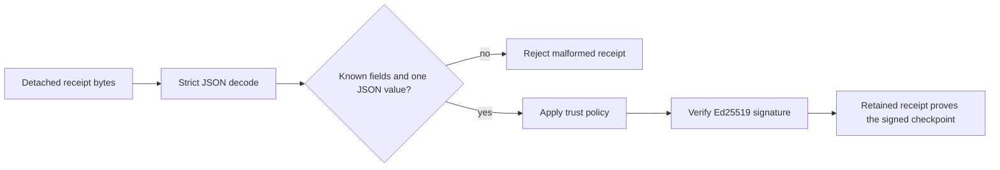

# Cryptographic evidence binding

This package implements a compact non-repudiation evidence core for WeaverSSH. It commits to exact observed bytes, groups evidence in Merkle trees, signs append-only checkpoints, verifies the complete statement chain, and optionally compares the local head with an independently retained witness.

A signature proves that a holder of a configured trusted private key signed a specific checkpoint. A witness is still required to prove that the presented local history has not been truncated after an authentic prefix.

## 1. Evidence commitment

`NewLeaf`, `VerifyPayload`, and `hashLeaf` bind an evidence identifier and semantic metadata to the SHA-256 digest of the exact observed bytes. The bytes themselves are not embedded in the leaf.

```mermaid
flowchart LR
    P[Observed payload bytes] --> PD[PayloadSHA256 = SHA-256 payload]
    M[ID, subject, kind, observed time] --> L[Canonical Leaf JSON]
    PD --> L
    L --> D0[Prefix 0x00]
    LD[Leaf domain\nweaverssh:evidence:leaf:v1] --> D0
    D0 --> LH[Leaf hash = SHA-256 prefix + domain + canonical leaf]

    CP[Claimed payload bytes] --> CPD[SHA-256 claimed payload]
    CPD --> EQ{Equals PayloadSHA256?}
    PD --> EQ
    EQ -->|yes| ACCEPT[Exact payload commitment verified]
    EQ -->|no| DENY[Denial or substitution detected]
```



The domain and type prefix prevent a leaf commitment from being confused with an internal Merkle node or a signed statement.

## 2. Merkle-root construction

`BuildMerkleRoot` hashes each canonical leaf, combines adjacent hashes, and duplicates the final node when a level has an odd width.



Internal nodes use a separate commitment:

```text
SHA-256(0x01 || "weaverssh:evidence:node:v1\x00" || left || right)
```

Duplicate evidence identifiers are rejected before the tree is constructed.

## 3. Merkle inclusion proof

`BuildMerkleProof` records one sibling per level and whether that sibling belongs on the left. `VerifyMerkleProof` recomputes the path and also validates the expected direction at every level.



A changed leaf, sibling hash, sibling direction, index, leaf count, or root causes verification to fail.

## 4. Signed checkpoint creation

`NewStatement` commits one evidence batch to an append-only stream. `SignStatement` signs the domain-separated canonical statement with Ed25519.



The statement digest used by the append-only chain is:

```text
SHA-256("weaverssh:evidence:statement:v1\x00" || canonical_statement_json)
```

For sequence `1`, `PreviousSHA256` must be empty. Every later sequence must contain the preceding statement digest.

## 5. Trusted signature verification

`TrustPolicy.Verify` does not trust the public key merely because it is embedded in the receipt. It resolves `SignerKeyID` in the configured trust policy, requires the embedded key to equal that trust anchor exactly, and only then verifies the Ed25519 signature.



This detects statement mutation, signer substitution, malformed signatures, and untrusted keys.

## 6. Append-only ledger verification

`VerifyLedger` validates one complete local stream in order. It rejects gaps, reordering, duplicate replay, removal from the middle, cross-stream substitution, and broken previous-hash links.



## 7. Independently witnessed head

A valid local prefix cannot reveal that a later valid suffix was deleted. The verifier needs an independently retained head to detect that denial.



Without the witness, the prefix ending at `H1` remains authentic but cannot be claimed to be complete.

## 8. Equivocation detection

`Witness.Observe` stores one statement digest for each `(stream ID, sequence)` pair. Two independently valid but different signed statements at the same position constitute equivocation.



## 9. Detached receipt verification

A consumer can retain a `SignedStatement` independently of the producer. `DecodeSignedStatement` rejects unknown JSON fields and trailing JSON values before trust and signature verification.



The detached receipt continues to verify even when the producer later deletes or denies its local copy, provided the verifier still has the trusted public-key policy and the receipt bytes.

## Security claims and limits

| Claim | Mechanism |
|---|---|
| Exact payload cannot be silently substituted | Payload SHA-256 inside the signed Merkle commitment |
| Evidence cannot be silently removed from a signed batch | Merkle root and inclusion proof |
| A signed statement cannot be modified | Ed25519 signature over canonical, domain-separated bytes |
| An embedded replacement key cannot authorize itself | Exact trusted-key comparison before signature verification |
| Stream entries cannot be reordered or removed internally | Sequence and `PreviousSHA256` chain |
| A signer cannot safely present conflicting heads to the same witness | Witness equivocation map keyed by stream and sequence |
| A producer cannot deny a receipt retained by another party | Detached signed statement and explicit trust policy |
| A local authentic prefix is complete | Only when it matches an independently retained witnessed head |

The package provides cryptographic evidence and verification logic. It does not make ordinary local storage physically immutable and cannot prove that no later statement existed unless an independent party retained the later head.